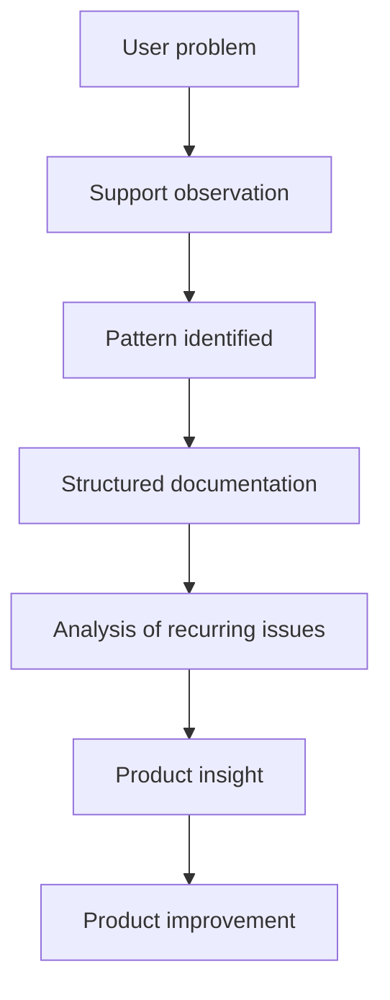

# Support Insights

Support Insights is a knowledge repository about how technical support teams can analyze user problems, document them clearly, and transform recurring issues into opportunities for product improvement.

This project explores how support teams can move beyond reactive problem-solving and contribute to continuous product evolution.

---

## 🌍 Language

The main content of this repository is currently written in **Portuguese (Brazil)**.

The README is written in English to make the purpose of the project accessible to a broader audience.

---

## 🎯 Objective

The goal of this repository is to organize practical knowledge about how support teams can:

- identify patterns in user-reported problems
- document issues in a structured way
- analyze recurring user difficulties
- generate insights that contribute to product improvement

Instead of treating support only as incident resolution, this project explores how support can become a **source of learning for product teams**.

---

## 📚 Contents

1. [Identificando padrões de problemas](01-identificando-padroes-de-problemas.md)  
2. [Documentando problemas de forma estruturada](02-documentando-problemas.md)  
3. [Transformando problemas em melhorias](03-transformando-problemas-em-melhorias.md)  
4. [Boas práticas de suporte técnico](04-boas-praticas-de-suporte.md)  
5. [Checklist de análise de problemas](05-checklist-de-analise-de-problemas.md)  
6. [Princípios de suporte](06-principios-de-suporte.md)

---

## 🧭 How to Read This Repository

The documents follow a logical progression that reflects how problems are typically analyzed in support environments.

### Conceptual flow

---

### Reading order

The suggested reading sequence is:

1. **Identify patterns in problems**  
2. **Document problems clearly**  
3. **Transform problems into improvements**  
4. **Apply support best practices**  
5. **Use a checklist to analyze issues**  
6. **Understand the principles behind the process**

Each document can also be read independently as a reference.

---

## 👥 Who This Repository Is For

This repository may be useful for:

- technical support professionals
- product teams interested in user feedback
- people working between **support and product development**
- anyone interested in structured problem analysis within software systems

---

## 📂 Project Structure

You can explore the full repository structure here:

➡️ [Project Structure](PROJECT_STRUCTURE.md)

---

## 🤝 Contributing

Contributions that improve clarity, add examples, or expand the ideas explored in this repository are welcome.

Please read the contribution guidelines before submitting changes:

➡️ [Contributing Guide](CONTRIBUTING.md)

---

## 🔒 Security

If you discover a security-related issue related to the repository, please follow the guidelines described here:

➡️ [Security Policy](SECURITY.md)

---

## 💡 Final Note

Support teams are often the first to observe how systems behave in real-world usage.

When problems are analyzed carefully, they can reveal insights that help improve both the product and the user experience.

This repository explores that perspective.
